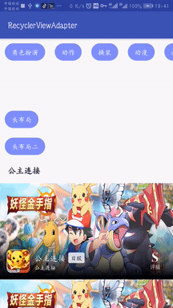

# lib-android-adapter
Android 列表适配器，支持 RecyclerView

功能：
1. 多布局（含多种监听器）
2. 单布局
3. 头尾布局（装饰者模式）

## 依赖
这个还在摸索中，望大神指教，尽快弄成以下形式：

```
dependencies {
    implementation 'io.github.jefshi:lib-adapter-recyclerview:2.0.0'
}
```

## andoridx

androidx 的使用和源码，请切换到 androidx 分支

## 外围使用：
[sample - MainActivity](./sample/src/main/java/com/csp/sample/adapter/MainActivity.java)
``` java
RecyclerView rcvSingle = findViewById(R.id.rcv_single);
TagAdapter tagAdapter = new TagAdapter(this);
rcvSingle.setLayoutManager(new LinearLayoutManager(this, LinearLayoutManager.HORIZONTAL, false));
rcvSingle.setAdapter(tagAdapter);

tagAdapter.setOnItemClickListener((parent, view, holder, position) -> {
    String item = tagAdapter.getItem(position);
    Toast.makeText(this, "删除该标签：" + item, Toast.LENGTH_SHORT).show();
});

List<String> tags = getTags();
tagAdapter.addData(tags, false);
tagAdapter.notifyDataSetChanged();
```

## 单布局使用：
[sample - TagAdapter](./sample/src/main/java/com/csp/sample/adapter/adapter/TagAdapter.java)
``` java
public class TagAdapter extends SingleAdapter<String> {

    /**
     * 添加布局 ID
     */
    public TagAdapter(Context context) {
        super(context, R.layout.item_tag);
    }

    /**
     * 布局和数据绑定
     */
    @Override
    protected void onBind(ViewHolder holder, String datum, final int position) {
        holder.setText(R.id.txt_tag, datum);
    }
}
```

## 多布局使用：
[sample - MixAdapter](./sample/src/main/java/com/csp/sample/adapter/adapter/MixAdapter.java)
``` java
public class MixAdapter extends MultipleAdapter<TopDto> {

    public MixAdapter(Context context) {
        super(context);
    }

    /**
     * 原始数据变化时，Item 对应的数据和 View 更新，但不主动刷新列表
     */
    @Override
    public void onDataChanged() {
        super.onDataChanged();

        mItemData.clear();  // 数据集合，Adapter 内部数据，与 Item 一一对应
        mItemViews.clear(); // 布局集合，Adapter 内部数据，与 Item 一一对应
        for (int i = 0; i < mData.size(); i++) {  // 原始数据集合，外围通过 Adapter 影响，但与 Item 不一一对应
            TopDto datum = mData.get(i);
            if (i % 2 == 0) {
                mItemData.add(datum.getChineseName());
                mItemViews.add(new TitleItemView()); // 标题布局
            }
            mItemData.add(datum);
            mItemViews.add(new TopItemView()); // 内容布局
        }
    }
}
```

注：MultipleAdapter 数据集分以下三种
``` java
protected List<T> mData; // 原始数据集合，外围通过 Adapter 影响，但与 Item 不一一对应
protected List<Object> mItemData; // 数据集合，Adapter 内部数据，与 Item 一一对应
protected List<IItemView> mItemViews; // 布局集合，Adapter 内部数据，与 Item 一一对应
```

[sample - TitleItemView](./sample/src/main/java/com/csp/sample/adapter/adapter/TitleItemView .java)
``` java
class TitleViewFill implements MultipleAdapter.IViewFill<String> {

    /**
     * 添加布局 ID
     */
    @Override
    public int getLayoutId() {
        return R.layout.item_title;
    }

    /**
     * 布局和数据绑定
     */
    @Override
    public void onBind(final ViewHolder holder, String title, final int position) {
        holder.setText(R.id.txt_title, title);
    }
}
```

[sample - TitleItemView](./sample/src/main/java/com/csp/sample/adapter/adapter/TitleItemView .java)
``` java
class TopItemView implements MultipleAdapter.IItemView<TopDto> {

    private final static int[] IMG_GRADE_RES = new int[]{
            R.drawable.ic_grade_s,
            R.drawable.ic_grade_a,
            R.drawable.ic_grade_b,
    };

    @Override
    public int getLayoutId() {
        return R.layout.item_top;
    }

    @Override
    public void onBind(ItemViewHolder holder, TopDto datum, int position) {
        int grade;
        switch (datum.getGameGrade()) {
            case "S":
                grade = 0;
                break;
            case "A":
                grade = 1;
                break;
            default:
            case "B":
                grade = 2;
                break;
        }
        holder.setText(R.id.txt_label, datum.getChineseName())
                .setText(R.id.txt_booster, datum.getGameService())
                .setText(R.id.txt_describe, datum.getGameRecommendText())
                .setImageResource(R.id.img_grade, IMG_GRADE_RES[grade]);
    }
}
```

## 头尾布局
装饰者模式，任意 RecyclerView.Adapter 均可，实现原理为多布局
``` java
MixAdapter mixAdapter = new MixAdapter(this);
HeadFootAdapter adapter = new HeadFootAdapter(mixAdapter);
rcvMultiple.setLayoutManager(new LinearLayoutManager(this, LinearLayoutManager.VERTICAL, false));
rcvMultiple.setAdapter(adapter);

View view = adapter.addHeaderView(R.layout.item_tag, rcvMultiple);
((TextView) view.findViewById(R.id.txt_tag)).setText("头布局");

view = adapter.addFootView(R.layout.item_tag, rcvMultiple);
((TextView) view.findViewById(R.id.txt_tag)).setText("尾布局");
```

## ISnapHelperExtend
TODO 补充说明：RecyclerView + SnapHelper 时，实现类似 {@link ViewPager.OnPageChangeListener} 的监听
``` java
LinearSnapHelper snapHelper = new LinearSnapHelper();
snapHelper.attachToRecyclerView(rcvMultiple);
ISnapHelperExtend.OnScrollListener listener = new ISnapHelperExtend.OnScrollListener(snapHelper);
listener.setOnPageChangeListener(new ISnapHelperExtend.OnPageChangeListener() {
    @Override
    public void onScrollStateChanged(RecyclerView recyclerView, int newState) {
    }

    @Override
    public void onScrolled(RecyclerView recyclerView, int dx, int dy) {
    }
    
    @Override
    public void onPageSelected(int position) {
    }
});
rcvMultiple.addOnScrollListener(listener);
```

## 其他说明

- 已兼容 notifyItemRemoved() 系列 API

## Sample


## 感谢
- [张鸿洋 - baseAdapter](https://github.com/hongyangAndroid/baseAdapter)：主要参考对象，尤其是 ViewHolder 类
- [RecyclerView实现类似ViewPager翻页OnPageChangeListener监听功能](https://blog.csdn.net/u012854870/article/details/84984066)
